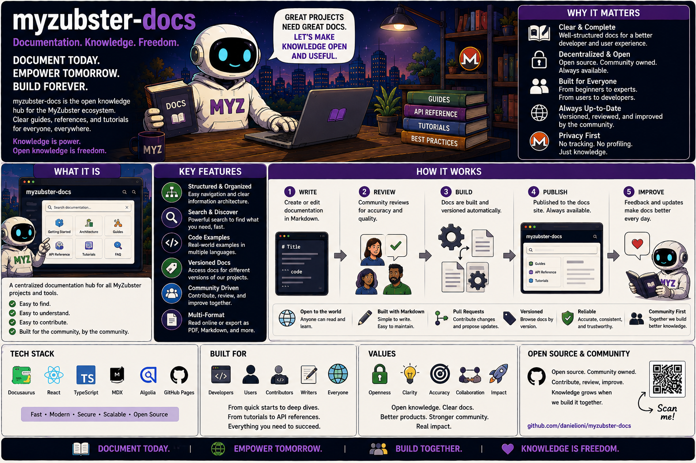

# MyZubster Documentation Hub

<p align="center">
  
</p>

> 🌍 **Understand MyZubster in your language:** [Global multilingual guide](https://github.com/MyZubster-Ecosystem/myzubster/blob/main/docs/i18n/README.md) — English, Italiano, Español, Français, Deutsch, Português, 中文, 日本語, 한국어, العربية, हिन्दी, Русский, Türkçe, Bahasa Indonesia, Polski, Українська, বাংলা, اردو, فارسی, Kiswahili.
>
> MyZubster connects real-world observations, verifiable evidence, collaborative bounties and platform rewards. **MYZ is currently an internal reward/accounting ledger; external XMR/token/blockchain settlement is separate and independently verified.**

MyZubster is an open-source ecosystem in active development and validation for documenting real-world observations, coordinating verifiable bounty work, publishing selected public state through content-addressed infrastructure, and experimenting with applications, robotics, IoT and privacy-oriented integrations.

This repository is the cross-project documentation hub. The canonical technical architecture and bounty rules live in the main [`myzubster`](https://github.com/MyZubster-Ecosystem/myzubster) repository.

## Current project positioning

MyZubster is **not** defined by a single blockchain, robot or payment rail. Different repositories have different maturity levels: operational MVP components, prototypes, simulations, private service boundaries and proposed integrations coexist in the organization.

Claims in historical issues or posts should not be interpreted as proof that a feature is production-ready or that a bounty was paid.

## Ecosystem map

| Repository | Responsibility | Positioning |
|---|---|---|
| [`myzubster`](https://github.com/MyZubster-Ecosystem/myzubster) | Core ecosystem, API/workflows, gardens, bounty/reward logic, public architecture | Primary source of truth |
| [`MyZubsterGateway`](https://github.com/MyZubster-Ecosystem/MyZubsterGateway) | Gateway/integration and settlement boundary | Active validation; external settlement requires independent verification |
| [`MyZubster-Marketplace`](https://github.com/MyZubster-Ecosystem/MyZubster-Marketplace) | Marketplace/service experiments | Development |
| [`MyZubster-App`](https://github.com/MyZubster-Ecosystem/MyZubster-App) | Mobile/client application | Development |
| [`MyZubsterWeb`](https://github.com/MyZubster-Ecosystem/MyZubsterWeb) | Web presence | Repository bootstrap/synchronization track |
| [`myzubster-animal-registry`](https://github.com/MyZubster-Ecosystem/myzubster-animal-registry) | Animal/NFC registry experiment | Experimental; no blanket blockchain-storage claim |
| [`MyZubster-Robot`](https://github.com/MyZubster-Ecosystem/MyZubster-Robot) | Robotics | Prototype/simulation/hardware-integration track |
| [`EVA-IONI`](https://github.com/MyZubster-Ecosystem/EVA-IONI) | EVA IONI robotics/software | Experimental |
| [`myzubster-space-station`](https://github.com/MyZubster-Ecosystem/myzubster-space-station) | Software vertical slice/telemetry | MVP track; not a physical-space-station claim |
| [`myzubster-manuals`](https://github.com/MyZubster-Ecosystem/myzubster-manuals) | Manuals/runbooks | Documentation bootstrap |
| `ai-automation`, `myzubster-ai-bot`, `myzubster-escrow-api`, `myzubster-verifier` | Internal service boundaries | Private/internal tracks |

The complete repository map, including `myzubster-platform`, `MyZubster-Robot-Stack` and the external/upstream `tari` dependency, is maintained in [`docs/ECOSYSTEM.md`](https://github.com/MyZubster-Ecosystem/myzubster/blob/main/docs/ECOSYSTEM.md).

## Bounty system

The canonical policy is [`BOUNTIES.md`](https://github.com/MyZubster-Ecosystem/myzubster/blob/main/BOUNTIES.md).

The work lifecycle is deliberately separated from settlement:

```text
PROPOSED -> VALIDATED -> APPROVED -> FUNDED -> ACTIVE
         -> SUBMITTED -> UNDER_REVIEW -> VERIFIED
         -> REWARD_RECORDED -> SETTLEMENT_PENDING / SETTLED
```

Important rules:

- an issue, PR or merge does not prove payment;
- MYZ in the current core platform is an **internal reward/accounting ledger**;
- external XMR/token settlement must remain pending/unsettled until independently verified;
- no adapter/provider response alone may declare a payment final;
- sensitive work requires explicit authorization, privacy controls and appropriate review.

## IPFS public-state layer

The core platform can publish sanitized public snapshots to IPFS/IPNS, including indexes for photos, bounties, reward records, crawler observations and discoveries.

IPFS provides immutable content addressing and replication. It does **not** by itself decentralize authorization, review, application consensus or financial settlement. Operational application state still uses service/database layers while public snapshots are independently addressable.

Never publish secrets, private user identifiers, confidential research or sensitive infrastructure details into public IPFS metadata.

## Documentation principles

Documentation in every MyZubster repository should:

1. describe what is actually implemented;
2. distinguish `production`, `development`, `testnet`, `simulation`, `experimental` and `proposed` states;
3. avoid treating historical bounty amounts as proof of payment;
4. keep security-sensitive data and secrets out of repositories;
5. link to the canonical architecture and bounty policy rather than redefining incompatible rules locally.

## Getting started

Start with the main repository:

```bash
git clone https://github.com/MyZubster-Ecosystem/myzubster.git
cd myzubster
npm ci
```

Then read the repository-specific README and `.env.example` before starting a component. Never copy production secrets into GitHub issues, examples or documentation.

## Contributing

1. Select an open issue or propose a narrowly scoped change.
2. Verify the repository's current status and setup instructions.
3. Add tests/evidence appropriate to the work.
4. Open a PR linked to the issue.
5. Treat bounty verification and external settlement as separate steps.

For bounty work, read the canonical bounty policy before claiming a reward.

## Transparency & automation

MyZubster uses automation to assist with issue triage, documentation and development workflows. Automated output does not replace maintainer/security review for sensitive changes, bounty verification or settlement decisions.

## Security

Never commit or paste:

- private keys or wallet seed phrases;
- production passwords/tokens;
- private infrastructure credentials;
- confidential user/research data.

For security findings, use the repository's responsible-disclosure process rather than publishing unpatched exploit details in a public issue.

## License

Repository-specific licenses remain authoritative. Check the target repository before reusing code or documentation.
